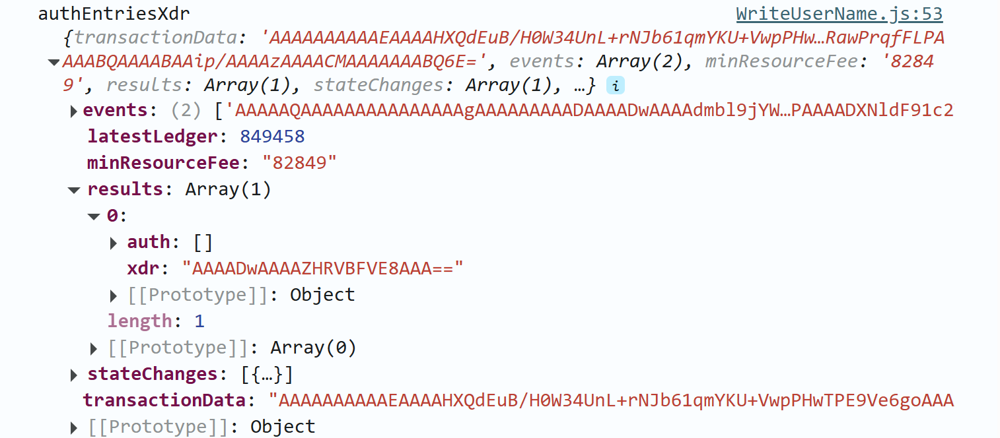
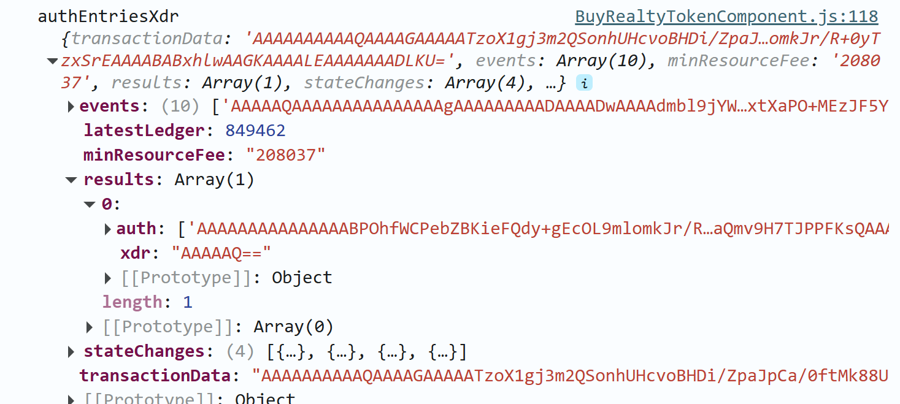

✅ What You Do Need to Do:
To pass auth checks in Soroban contracts:

Include the target address (e.g. buyer) as an argument

Inside contract: use buyer.require_auth();

Simulate the transaction before signing

The simulation tells you what auth_entries are needed

You then construct a tx that includes those auth_entries

User signs using their wallet (e.g., Freighter)

In here, we see that noting is returned from the simulation for the auth value.

In here, we see that there is smg returned from the simulation for the auth value.